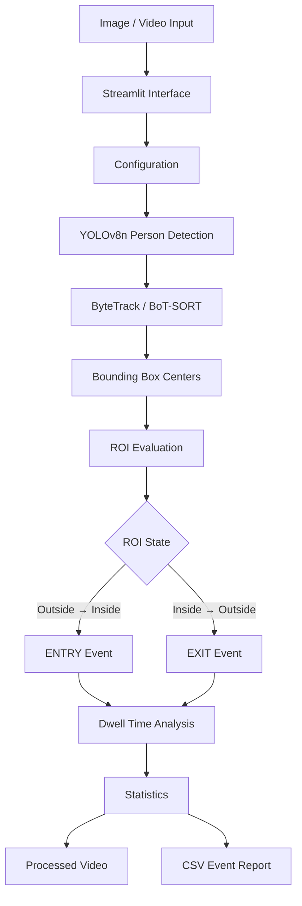

# Day 39 | Optimized Security Monitoring System

<p align="center">
  <strong>Computer Vision • Object Detection • Object Tracking • ROI Analytics • Event Monitoring</strong>
</p>

<p align="center">
  An optimized security-monitoring pipeline built with YOLOv8, Ultralytics tracking, OpenCV, Pandas, and Streamlit.
</p>

<p align="center">


</p>

---

## Overview

**Day 39** extends the previous security-monitoring pipeline into a more configurable and analytics-focused computer-vision application.

The system detects people using **YOLOv8n**, maintains tracking identities across video frames using **ByteTrack** or **BoT-SORT**, monitors a configurable **Region of Interest (ROI)**, and converts movement through that region into structured security events.

The application provides:

* Person detection
* Persistent object tracking
* ROI monitoring
* Entry and exit detection
* Dwell-time calculation
* Tracking trails
* Occupancy analytics
* Configurable inference parameters
* Frame-skip optimization
* CSV event reporting
* Image and video processing
* Crossing-case tracker evaluation
* Streamlit-based interaction
* Automated utility tests

The goal is to demonstrate how a basic object-detection pipeline can evolve into a structured monitoring and analytics system.

---

## Architecture



---

## Core Capabilities

### Person Detection

The system uses **YOLOv8n** to detect people in images and videos.

Only the COCO `person` class is processed:

```python
classes=[0]
```

Restricting inference to the person class reduces unnecessary detections and keeps the pipeline focused on security-monitoring scenarios.

---

### Persistent Object Tracking

For video processing, the application supports:

| Tracker       | Purpose                                                  |
| ------------- | -------------------------------------------------------- |
| **ByteTrack** | Fast and efficient multi-object tracking                 |
| **BoT-SORT**  | Tracking with stronger appearance and motion association |

Each tracked person receives an ID:

```text
ID 1
ID 2
ID 3
```

These IDs allow the application to associate detections across frames and calculate events such as entry, exit, and dwell time.

> Tracking IDs represent temporary object associations within a video. They do not represent real-world identities.

---

## Region of Interest

The system supports rectangular **Regions of Interest** for focused monitoring.

Typical applications include:

* Building entrances
* Security checkpoints
* Restricted corridors
* Warehouses
* Laboratories
* Office entrances
* Parking areas

The ROI is represented as:

```text
(x1, y1, x2, y2)
```

A person is considered inside the ROI when the center point of their bounding box falls within the configured boundaries.

---

## Entry and Exit Detection

The system maintains the ROI state of each tracked person.

The main state transitions are:

```text
Outside → Inside  = ENTRY
Inside → Outside  = EXIT
```

Example:

```text
Person ID 4 → ENTRY
Person ID 4 → EXIT
```

Each event can contain:

* Track ID
* Event type
* ROI
* Frame number
* Timestamp
* Entry time
* Exit time
* Duration
* Status

This converts frame-level detections into structured security events.

---

## Dwell-Time Analysis

Dwell time represents the amount of time a tracked person remains inside the ROI.

The calculation is:

```text
Dwell Time = Exit Time - Entry Time
```

Example:

```text
Entry Time: 12.50 seconds
Exit Time:  20.75 seconds
Dwell Time:  8.25 seconds
```

Dwell-time analysis can help identify prolonged occupancy and unusual waiting behavior within monitored areas.

---

## Configurable Inference

The Streamlit interface allows the user to adjust inference parameters without changing the source code.

### Confidence Threshold

Controls the minimum confidence required for a detection.

Default:

```text
0.45
```

Typical range:

```text
0.35 - 0.60
```

Lower values may detect more objects but can increase false positives. Higher values may improve precision but can miss difficult detections.

### IoU Threshold

Controls overlap handling during non-maximum suppression.

Default:

```text
0.50
```

### Inference Image Size

Available options:

```text
320
416
512
640
```

| Size | Typical Behavior                |
| ---: | ------------------------------- |
|  320 | Fastest, lower detail           |
|  416 | Faster processing               |
|  512 | Balanced option                 |
|  640 | Higher detail, slower inference |

---

## Frame-Skip Optimization

Video processing can be computationally expensive when every frame is analyzed.

The application supports processing every Nth frame.

```text
frame_skip = 1
```

Processes every frame.

```text
frame_skip = 2
```

Processes every second frame.

```text
frame_skip = 3
```

Processes every third frame.

Frame skipping can improve processing speed, especially for longer videos. Excessive skipping can reduce tracking stability and event-timing precision.

### Recommended Values

**Accuracy-focused**

```text
Frame Skip: 1
```

**Faster demonstration**

```text
Frame Skip: 2
```

---

## Tracking Trails

The application can display recent movement paths for tracked people.

Tracking trails help visualize:

* Movement direction
* Walking paths
* ROI transitions
* Tracking consistency
* Potential ID switches

Trail history is bounded to avoid unlimited memory growth during long video processing.

---

## Analytics Dashboard

After processing a video, the application provides key performance and monitoring metrics.

| Metric             | Description                             |
| ------------------ | --------------------------------------- |
| Peak ROI Count     | Maximum number of people inside the ROI |
| Average ROI Count  | Average ROI occupancy                   |
| Unique IDs         | Total distinct tracking IDs             |
| Entries            | Number of entry events                  |
| Exits              | Number of exit events                   |
| Average Dwell Time | Average time spent inside the ROI       |
| Processing FPS     | Approximate processing speed            |
| Frames Processed   | Frames read from the source video       |
| Sampled Frames     | Frames passed through the model         |

Example output:

```text
Peak ROI Count:       5
Unique Tracked IDs:  12
Entries:             12
Exits:               12
Average Dwell Time:  8.42 seconds
Processing FPS:      6.75
Frames Processed:    900
Sampled Frames:      900
Average ROI Count:   2.31
```

Actual values depend on the input video, hardware, model configuration, and tracker behavior.

---

# Project Structure

```text
Day-39/
│
├── app.py
│   └── Streamlit interface
│
├── security_monitoring.py
│   └── Detection, tracking, ROI, events, analytics,
│       video processing, and report generation
│
├── test_day39.py
│   └── Automated utility tests
│
├── requirements.txt
│   └── Python dependencies
│
├── README.md
│   └── Project documentation
│
├── .gitignore
│   └── Git exclusions
│
├── .streamlit/
│   └── config.toml
│
├── sample_videos/
│   ├── README.md
│   ├── crossing_case_01.mp4
│   └── crossing_case_02.mp4
│
├── outputs/
│   └── Generated videos and CSV reports
│
└── screenshots/
    └── Application screenshots
```

---

# Technology Stack

| Technology                | Role                             |
| ------------------------- | -------------------------------- |
| **Python**                | Application development          |
| **YOLOv8n**               | Person detection                 |
| **Ultralytics**           | Detection and tracking framework |
| **ByteTrack**             | Multi-object tracking            |
| **BoT-SORT**              | Multi-object tracking            |
| **OpenCV**                | Image and video processing       |
| **NumPy**                 | Numerical operations             |
| **Pandas**                | Event data and analytics         |
| **Pillow**                | Image handling                   |
| **Streamlit**             | Interactive web interface        |
| **pytest / Python tests** | Utility validation               |

---

# File Responsibilities

## `app.py`

The Streamlit application handles:

* Page configuration
* Image uploads
* Video uploads
* Sidebar controls
* Tracker selection
* Processing controls
* Progress feedback
* Analytics display
* Download functionality
* Error reporting

---

## `security_monitoring.py`

The core computer-vision module contains:

* YOLO model loading
* Person detection
* Object tracking
* ROI evaluation
* Entry detection
* Exit detection
* Dwell-time calculation
* Tracking trails
* Statistics generation
* Processed-video creation
* CSV report generation

Separating the processing layer from the user interface improves maintainability and testability.

---

## `test_day39.py`

Contains automated checks for important utility logic, including:

* ROI boundary behavior
* Points outside the ROI
* Empty ROI handling
* Event dataframe structure
* Event data types

---

## `.streamlit/config.toml`

Contains Streamlit configuration.

Example:

```toml
[server]
maxUploadSize = 500
```

The value represents the maximum upload size in megabytes.

---

# Installation

## 1. Navigate to the Project

```powershell
cd "C:\path\to\Day-39"
```

## 2. Create a Virtual Environment

```powershell
py -3.13 -m venv .venv
```

## 3. Activate the Environment

```powershell
.\.venv\Scripts\Activate.ps1
```

## 4. Upgrade pip

```powershell
python -m pip install --upgrade pip
```

## 5. Install Dependencies

```powershell
pip install -r requirements.txt
```

Ultralytics may download the required YOLO model automatically during the first inference run.

---

# Run the Application

Start Streamlit:

```powershell
streamlit run app.py
```

Default address:

```text
http://localhost:8501
```

To use another port:

```powershell
streamlit run app.py --server.port 8502
```

---

# Testing

Run the Day 39 tests:

```powershell
python test_day39.py
```

Expected result:

```text
Day 39 tests passed successfully.
```

The tests focus on supporting logic and do not require a complete video-processing run.

---

# Application Workflow

## Image Monitoring

1. Open the Image Monitoring interface.
2. Upload a JPG, JPEG, or PNG image.
3. Start image monitoring.
4. Review detected people.
5. Download the processed image.

## Video Monitoring

1. Open the Video Monitoring interface.
2. Upload a supported video.
3. Configure confidence and IoU thresholds.
4. Select the inference image size.
5. Select ByteTrack or BoT-SORT.
6. Configure frame skipping.
7. Enable or disable tracking trails.
8. Start video processing.
9. Review the processed video.
10. Review the analytics.
11. Download the processed video.
12. Download the CSV event report.

---

# Recommended Configurations

## Accuracy Focused

```text
Confidence: 0.35 - 0.45
IoU:        0.50
Image Size: 640
Frame Skip: 1
Tracker:    ByteTrack / BoT-SORT
Trails:     Enabled
```

## Balanced

```text
Confidence: 0.45
IoU:        0.50
Image Size: 512
Frame Skip: 1
Tracker:    ByteTrack
Trails:     Enabled
```

## Speed Focused

```text
Confidence: 0.45 - 0.60
IoU:        0.50
Image Size: 320 / 416
Frame Skip: 2 - 3
Tracker:    ByteTrack
Trails:     Disabled
```

The optimal configuration depends on video resolution, scene complexity, available hardware, and the desired balance between speed and accuracy.

---

# CSV Event Reporting

The application generates a structured CSV report containing security events.

Example:

```csv
track_id,event,roi,frame,timestamp_s,entry_time_s,exit_time_s,duration_s,status
7,ENTRY,ROI,150,6.00,6.00,,,active
7,EXIT,ROI,310,12.40,6.00,12.40,6.40,completed
```

## Report Fields

| Field          | Description                        |
| -------------- | ---------------------------------- |
| `track_id`     | Tracking ID assigned to the person |
| `event`        | `ENTRY` or `EXIT`                  |
| `roi`          | Monitored region                   |
| `frame`        | Event frame number                 |
| `timestamp_s`  | Event timestamp                    |
| `entry_time_s` | Recorded entry time                |
| `exit_time_s`  | Recorded exit time                 |
| `duration_s`   | Time spent inside the ROI          |
| `status`       | Event or session status            |

The report can be analyzed using Excel, Google Sheets, Pandas, or other data-analysis tools.

---

# Crossing-Case Evaluation

Day 39 introduces a dedicated evaluation scenario for tracking people who cross paths or become partially occluded.

The evaluation compares **ByteTrack** and **BoT-SORT** under the same video conditions.

### Evaluation Process

1. Prepare two crossing-case videos.
2. Run both videos using ByteTrack.
3. Repeat the tests using BoT-SORT.
4. Keep inference settings consistent.
5. Compare tracking behavior.

### Evaluation Criteria

* Tracking-ID stability
* ID switches
* Duplicate events
* Entry accuracy
* Exit accuracy
* ROI-count stability
* Tracker performance
* Effect of frame skipping
* Effect of confidence thresholds

### Evaluation Table

| Test            | Tracker   | Frame Skip | ID Stability       | Duplicate Events | Result |
| --------------- | --------- | ---------: | ------------------ | ---------------- | ------ |
| Crossing Case 1 | ByteTrack |          1 | Good / Fair / Poor | Yes / No         | Notes  |
| Crossing Case 1 | BoT-SORT  |          1 | Good / Fair / Poor | Yes / No         | Notes  |
| Crossing Case 2 | ByteTrack |          1 | Good / Fair / Poor | Yes / No         | Notes  |
| Crossing Case 2 | BoT-SORT  |          1 | Good / Fair / Poor | Yes / No         | Notes  |

This evaluation demonstrates how tracker selection can affect identity consistency in crowded scenes.

---

# Performance Optimization

The system applies several practical optimization techniques.

### Lightweight Model

YOLOv8n provides a useful balance between detection capability and inference speed.

### Person-Only Detection

Processing only the person class reduces unnecessary model output.

### Frame Skipping

Allows the application to trade temporal precision for processing speed.

### Configurable Resolution

Inference resolution can be adjusted according to available hardware and scene complexity.

### Tracker Selection

ByteTrack and BoT-SORT provide alternative tracking strategies for different scenarios.

### Bounded Trail History

Only a limited number of historical points are retained for each tracking ID.

### Modular Architecture

The interface and processing logic are separated into independent modules.

### Error Handling

The application handles common problems such as:

* Invalid uploads
* Unsupported files
* Unreadable videos
* Inference failures
* Output-generation errors
* Invalid processing inputs

---

# Optional Remote Demonstration

For temporary demonstrations, the Streamlit application can be exposed using ngrok.

```powershell
ngrok http 8501
```

If the application is running on port `8502`:

```powershell
ngrok http 8502
```

Only expose footage that is appropriate for public demonstration. Avoid using private or sensitive recordings.

---

# Limitations

The current system has several practical limitations:

1. Severe occlusion can cause tracking-ID switches.
2. People crossing directly in front of each other can reduce tracking consistency.
3. Poor lighting can reduce detection quality.
4. Very small people may be missed.
5. Frame skipping can reduce event-timing precision.
6. The current ROI implementation is rectangular.
7. The system does not identify people by name.
8. The system does not determine intent or suspicious behavior.
9. Performance depends on available CPU/GPU resources.
10. Video codec availability can vary between systems.

The application should therefore be considered an **educational and experimental monitoring system**, not an autonomous security decision-making platform.

---

# Privacy and Responsible Use

This project processes visual information that may contain people.

When working with real-world footage:

* Obtain appropriate authorization.
* Avoid uploading sensitive footage to public services.
* Do not use the system for unauthorized surveillance.
* Do not attempt to identify individuals by name.
* Store generated reports securely.
* Remove private footage before publishing the repository.
* Prefer anonymized or consented footage for demonstrations.

The system performs **person detection and temporary tracking**. It does not perform facial recognition or establish real-world identity.

---

# Future Improvements

Potential future extensions include:

* Polygon-based ROI selection
* Interactive ROI drawing
* Multiple monitoring regions
* Line-crossing detection
* Restricted-zone alerts
* Event deduplication
* ID-switch counting
* Occupancy-over-time charts
* Movement heatmaps
* Email and webhook notifications
* Real-time camera input
* GPU/CPU optimization
* SQLite or PostgreSQL storage
* Multi-camera monitoring
* Docker deployment
* Cloud deployment
* Automated PDF reports
* Improved occlusion handling
* Custom-trained detection models

---

# GitHub Checklist

Before publishing the project:

* [ ] `app.py` included
* [ ] `security_monitoring.py` included
* [ ] `requirements.txt` included
* [ ] `test_day39.py` included
* [ ] `README.md` completed
* [ ] `.gitignore` configured
* [ ] `.streamlit/config.toml` included
* [ ] Sample-video documentation included
* [ ] Crossing-case evaluation completed
* [ ] Screenshots added
* [ ] Tests passing
* [ ] No private footage committed
* [ ] No `.venv` files committed
* [ ] No unnecessary model weights committed
* [ ] No unnecessary generated outputs committed
* [ ] Application tested successfully
* [ ] Demonstration video prepared

---

# Demonstration Structure

For a professional project demonstration, the following sequence works well:

### 01 | Introduction

Briefly explain the problem, objective, and main improvements.

### 02 | Architecture

Show the project structure and explain the detection, tracking, ROI, and event pipeline.

### 03 | Configuration

Demonstrate:

* Confidence threshold
* IoU threshold
* Image size
* Frame skipping
* Tracker selection
* Tracking trails

### 04 | Image Detection

Show person detection on a sample image.

### 05 | Video Monitoring

Demonstrate:

* ROI monitoring
* Tracking IDs
* Tracking trails
* Entry events
* Exit events
* Processing progress
* Generated video

### 06 | Analytics

Show:

* Peak ROI count
* Unique tracking IDs
* Entries
* Exits
* Average dwell time
* Processing FPS
* CSV report

### 07 | Tracker Evaluation

Compare ByteTrack and BoT-SORT using crossing-case footage.

### 08 | Conclusion

Summarize the performance, configurability, tracking, and analytics improvements.

---

# Conclusion

**Day 39** transforms the previous security-monitoring prototype into a more structured, configurable, and analytics-oriented computer-vision application.

The system combines:

**YOLOv8n**

Person detection for image and video inputs.

**ByteTrack and BoT-SORT**

Persistent multi-object tracking.

**ROI Monitoring**

Focused analysis of defined areas.

**Event Detection**

Automatic entry and exit tracking.

**Dwell-Time Analysis**

Measurement of time spent inside monitored regions.

**Performance Controls**

Configurable confidence, IoU, resolution, and frame skipping.

**Analytics**

Occupancy, tracking, performance, and event statistics.

**Reporting**

Structured CSV event generation.

**Streamlit**

An interactive interface for running and reviewing the system.

The project demonstrates a practical progression from object detection toward a complete computer-vision monitoring workflow with configurable inference, persistent tracking, event-based analytics, and systematic tracker evaluation.

---

## Author

**Hadeed Jalani**

Computer Vision • Artificial Intelligence • Machine Learning • Python

---
