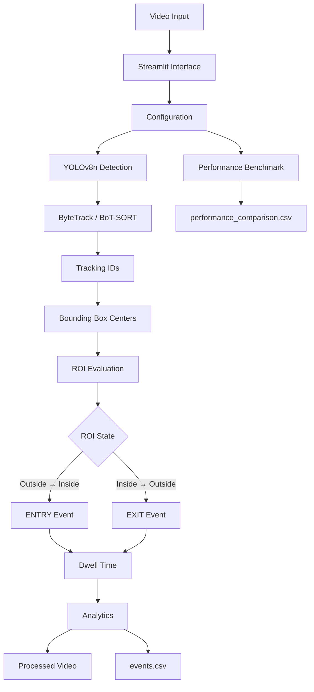

# Day 40 | Smart Video Analytics System

<p align="center">
  <strong>Computer Vision • Object Detection • Object Tracking • ROI Analytics • Performance Benchmarking</strong>
</p>

<p align="center">
  A configurable video analytics platform built with YOLOv8, Ultralytics tracking, OpenCV, Pandas, and Streamlit.
</p>

---

## Overview

**Day 40** develops a complete video analytics pipeline for processing recorded video, detecting and tracking moving objects, monitoring a configurable **Region of Interest (ROI)**, identifying entry and exit events, calculating performance statistics, and generating structured analytical reports.

The system uses **YOLOv8n** for object detection and supports both **ByteTrack** and **BoT-SORT** for multi-object tracking.

The application is designed for recorded video analysis and provides configurable controls for balancing detection quality, tracking stability, and processing speed.

### Core Capabilities

* Video upload and processing
* YOLOv8n object detection
* Person-focused detection
* ByteTrack and BoT-SORT tracking
* Persistent tracking IDs
* Configurable Region of Interest
* Entry and exit detection
* Dwell-time calculation
* Object counting
* ROI occupancy analytics
* FPS measurement
* Processing-time measurement
* Frame-skip optimization
* Configurable inference resolution
* Tracking trails
* CSV event reporting
* Performance benchmarking
* Streamlit interface
* Automated utility testing

The project focuses on building a practical and understandable video analytics system rather than introducing unnecessary complexity.

---

# Architecture



---

# Project Objective

The primary objective is to implement a complete computer-vision video analytics workflow:

```text
Video
   ↓
Frame Processing
   ↓
YOLO Object Detection
   ↓
Object Tracking
   ↓
Tracking IDs
   ↓
ROI Monitoring
   ↓
Entry / Exit Detection
   ↓
Analytics
   ↓
Performance Measurement
   ↓
Processed Video + CSV Reports
```

The project demonstrates how frame-level detections can be converted into meaningful movement events and measurable analytics.

---

# Object Detection

The application uses **YOLOv8n**, a lightweight YOLO model suitable for efficient object detection.

For the current implementation, the system focuses primarily on the **person** class.

The person class in the COCO dataset is represented by:

```python
classes=[0]
```

Each detection provides information such as:

* Bounding-box coordinates
* Object class
* Confidence score
* Detection position

Restricting inference to the required class reduces unnecessary processing and keeps the application focused on the intended analytics workflow.

---

# Object Tracking

Object detection identifies objects independently in individual frames. Tracking adds temporal continuity by attempting to associate detections across consecutive frames.

The application supports two tracking algorithms:

| Tracker       | Primary Strength                              |
| ------------- | --------------------------------------------- |
| **ByteTrack** | Efficient multi-object tracking               |
| **BoT-SORT**  | More robust association in challenging scenes |

Example:

```text
Person A → ID 1
Person B → ID 2
Person C → ID 3
```

When an object is detected again in subsequent frames, the tracker attempts to preserve its existing ID.

Tracking performance depends on:

* Video quality
* Object size
* Lighting conditions
* Camera movement
* Object overlap
* Occlusion
* Frame skipping
* Detection confidence
* Tracker configuration

> Tracking IDs are temporary technical identifiers within a processing session. They do not represent real-world identities.

---

# Region of Interest

A **Region of Interest**, commonly called an ROI, defines the specific area of the frame that the system monitors.

Typical applications include:

* Building entrances
* Parking areas
* Security checkpoints
* Corridors
* Restricted zones
* Warehouses
* Store entrances
* Road sections

The current implementation uses a rectangular ROI.

The ROI is represented using:

```text
(x1, y1, x2, y2)
```

The application allows the user to configure the ROI through the Streamlit interface.

---

# ROI Membership

For every detected object, the system calculates the center point of its bounding box.

Given:

```text
x1, y1, x2, y2
```

the center is calculated as:

```python
center_x = (x1 + x2) / 2
center_y = (y1 + y2) / 2
```

The object is considered inside the ROI when:

```text
ROI_left  ≤ center_x ≤ ROI_right
ROI_top   ≤ center_y ≤ ROI_bottom
```

This approach provides a simple and consistent method for determining whether a tracked object is inside or outside the monitored region.

---

# Entry and Exit Detection

The application compares the current ROI state of each tracking ID with its previous state.

The core event logic is:

```text
Outside → Inside = ENTRY
Inside → Outside = EXIT
```

Example:

```text
Frame 1: ID 7 outside ROI
Frame 2: ID 7 outside ROI
Frame 3: ID 7 inside ROI
         → ENTRY

Frame 4: ID 7 inside ROI
Frame 5: ID 7 outside ROI
         → EXIT
```

Each event can contain:

* Tracking ID
* Event type
* Frame number
* Timestamp
* Entry time
* Exit time
* Duration
* Status

Objects that remain inside the ROI until the video ends can be closed using the final video timestamp.

---

# Tracking IDs

Tracking IDs allow the system to associate detections across multiple frames.

For example:

```text
Person 1 → ID 4
Person 2 → ID 8
Person 3 → ID 12
```

Tracking IDs are used for:

* Unique object counting
* Movement tracking
* ROI monitoring
* Entry detection
* Exit detection
* Dwell-time calculation
* Event association
* Duplicate-event reduction

Tracking IDs are not permanent identities. If the tracker loses an object or encounters severe occlusion, a new ID may be assigned.

---

# Analytics Dashboard

The application calculates several metrics during video processing.

| Metric                 | Description                            |
| ---------------------- | -------------------------------------- |
| **Total Objects**      | Unique tracking IDs observed           |
| **Current ROI Count**  | Objects currently inside the ROI       |
| **Total Entries**      | Outside-to-inside transitions          |
| **Total Exits**        | Inside-to-outside transitions          |
| **Maximum ROI Count**  | Highest occupancy observed             |
| **Average ROI Count**  | Average ROI occupancy                  |
| **Average Dwell Time** | Average completed ROI session duration |
| **Average FPS**        | Measured processing speed              |
| **Processing Time**    | Total video-processing duration        |

Example:

```text
Total Objects:          18
Current ROI Count:       4
Total Entries:          18
Total Exits:            17
Maximum ROI Count:       7
Average ROI Count:      2.84
Average Dwell Time:     6.42 seconds
Average FPS:            8.15
Processing Time:        31.70 seconds
```

Actual values depend on the input video, hardware, model configuration, and tracker behavior.

---

# Dwell-Time Analysis

Dwell time represents how long an object remains inside the monitored ROI.

The calculation is:

```text
Dwell Time = Exit Time - Entry Time
```

Example:

```text
Entry Time:  8.40 seconds
Exit Time:  14.75 seconds
Dwell Time:  6.35 seconds
```

Average dwell time is calculated using completed ROI sessions.

Dwell-time analytics can provide useful information about occupancy patterns and the amount of time tracked objects spend within a monitored region.

---

# Performance Optimization

The application provides several controls for balancing processing speed and analytical quality.

## Inference Image Size

The system supports:

```text
480
640
```

### 480px

Advantages:

* Faster inference
* Lower computational requirements
* Useful for quick testing

Trade-offs:

* Small objects may be harder to detect
* Detection detail may be reduced

### 640px

Advantages:

* Higher detection detail
* Better for smaller objects
* More suitable for complex scenes

Trade-offs:

* Higher computational cost
* Potentially lower processing FPS

---

# Frame Skipping

Frame skipping reduces the number of frames passed through the detection and tracking pipeline.

```text
Frame Skip = 1
```

Processes every frame.

```text
Frame Skip = 2
```

Processes approximately every second frame.

```text
Frame Skip = 3
```

Processes approximately every third frame.

Frame skipping can improve processing speed but may reduce:

* Event-timing precision
* Tracking stability
* Detection continuity
* Entry and exit accuracy

### Recommended Starting Point

For accuracy:

```text
Frame Skip = 1
```

For faster demonstrations:

```text
Frame Skip = 2
```

Higher values should be used only after validating tracking and event accuracy.

---

# Confidence Threshold

The confidence threshold controls the minimum confidence required for a detection.

A higher threshold can:

* Reduce weak detections
* Reduce false positives
* Miss partially visible objects

A lower threshold can:

* Increase detection recall
* Detect weaker objects
* Increase false positives

The optimal value depends on the input video and scene complexity.

---

# IoU Threshold

**Intersection over Union (IoU)** measures the overlap between bounding boxes.

The IoU threshold influences how overlapping detections are handled during detection filtering.

It can affect:

* Duplicate detections
* Overlapping objects
* Crowded scenes
* Detection stability

The best value depends on the video and object density.

---

# Tracker Selection

The application provides two tracking options:

```text
ByteTrack
BoT-SORT
```

### ByteTrack

A practical starting point when:

* Processing speed matters
* The scene is relatively clear
* Objects are reasonably separated

### BoT-SORT

Useful for testing scenes containing:

* Partial occlusion
* Object overlap
* Crowded movement
* More complex object interactions

The best tracker should be selected based on measured tracking quality and processing performance.

---

# Tracking Trails

The application can optionally display movement trails for tracked objects.

A trail stores recent center-point positions for each tracking ID.

Trails help visualize:

* Movement direction
* Object paths
* ROI transitions
* Tracking consistency
* Potential ID switches

Trail history is bounded to prevent unnecessary memory growth during long video processing.

---

# Performance Benchmarking

The project includes a dedicated benchmarking script for comparing different processing configurations.

The benchmark evaluates:

| Configuration   | Image Size | Frame Skip |
| --------------- | ---------: | ---------: |
| Configuration 1 |      640px |          1 |
| Configuration 2 |      480px |          1 |
| Configuration 3 |      640px |          2 |
| Configuration 4 |      480px |          2 |

Run the benchmark with:

```powershell
python performance_test.py --video sample_videos/video_01.mp4
```

Results are saved to:

```text
outputs/performance_comparison.csv
```

The benchmark records:

* Video name
* Image size
* Frame skip
* Average FPS
* Processing time
* Total objects
* Total entries
* Total exits
* Maximum ROI count

The highest FPS configuration is not automatically the best configuration.

A useful evaluation should consider:

```text
Speed
+
Detection Quality
+
Tracking Stability
+
Event Accuracy
```

---

# Benchmark Interpretation

Different configurations provide different trade-offs.

### 480px + Frame Skip 1

```text
Good speed
Good temporal coverage
Lower detection detail
```

### 640px + Frame Skip 1

```text
Higher detection detail
Strong temporal coverage
Higher computational cost
```

### 480px + Frame Skip 2

```text
Faster processing
Lower computational cost
Reduced temporal precision
```

### 640px + Frame Skip 2

```text
Good detection detail
Reduced frame-processing workload
Potentially better speed than full-frame processing
```

Actual results should always be measured on the target hardware and video.

---

# Output Files

After processing, the application generates analytical outputs.

## Processed Video

The processed video can contain:

* Bounding boxes
* Tracking IDs
* ROI rectangle
* Current ROI count
* Unique object count
* FPS
* Frame number
* Tracking trails

Example:

```text
outputs/video_01_processed.mp4
```

---

## `events.csv`

The event report stores detected ROI transitions.

Example:

```csv
track_id,event,frame,timestamp_s,entry_time_s,exit_time_s,duration_s,status
4,ENTRY,120,4.80,4.80,,,active
4,EXIT,245,9.80,4.80,9.80,5.00,completed
```

### Report Fields

| Field          | Description           |
| -------------- | --------------------- |
| `track_id`     | Tracking ID           |
| `event`        | `ENTRY` or `EXIT`     |
| `frame`        | Event frame           |
| `timestamp_s`  | Event timestamp       |
| `entry_time_s` | Entry timestamp       |
| `exit_time_s`  | Exit timestamp        |
| `duration_s`   | Time spent inside ROI |
| `status`       | Event/session state   |

The resulting CSV can be analyzed using Pandas, Excel, Google Sheets, or other data-analysis tools.

---

## `performance_comparison.csv`

This file contains the results of the performance benchmark.

It allows different configurations to be compared based on:

* FPS
* Processing time
* Object count
* Entry count
* Exit count
* ROI occupancy

---

# Project Structure

```text
Day-40/
│
├── app.py
│   └── Streamlit application
│
├── video_analytics.py
│   └── Detection, tracking, ROI, events, analytics,
│       video processing, and report generation
│
├── performance_test.py
│   └── Performance benchmarking
│
├── coding_practice.py
│   └── OpenCV tracking practice
│
├── test_day40.py
│   └── Automated utility tests
│
├── requirements.txt
│   └── Python dependencies
│
├── README.md
│   └── Project documentation
│
├── .gitignore
│   └── Git exclusions
│
├── .streamlit/
│   └── config.toml
│
├── sample_videos/
│   ├── video_01.mp4
│   ├── video_02.mp4
│   ├── video_03.mp4
│   └── README.md
│
├── outputs/
│   ├── video_01_processed.mp4
│   ├── video_02_processed.mp4
│   ├── video_03_processed.mp4
│   ├── events.csv
│   ├── performance_comparison.csv
│   └── README.md
│
└── screenshots/
    └── README.md
```

---

# Technology Stack

| Technology      | Role                               |
| --------------- | ---------------------------------- |
| **Python**      | Application development            |
| **YOLOv8n**     | Object detection                   |
| **Ultralytics** | Detection and tracking framework   |
| **ByteTrack**   | Multi-object tracking              |
| **BoT-SORT**    | Multi-object tracking              |
| **OpenCV**      | Video processing and visualization |
| **NumPy**       | Numerical operations               |
| **Pandas**      | Event logging and analytics        |
| **Streamlit**   | Interactive application interface  |

---

# File Responsibilities

## `app.py`

The main Streamlit application handles:

* Video upload
* Processing controls
* ROI configuration
* Tracker selection
* Image-size selection
* Frame-skip settings
* Progress updates
* Analytics metrics
* Processed-video preview
* CSV downloads
* Error reporting

---

## `video_analytics.py`

The core video-processing module handles:

* YOLO model loading
* Video reading
* Object detection
* Object tracking
* Tracking IDs
* Bounding-box centers
* ROI evaluation
* Entry detection
* Exit detection
* Dwell-time calculation
* Statistics
* Processed-video generation
* CSV reporting

---

## `performance_test.py`

The benchmarking module evaluates different combinations of:

* Inference resolution
* Frame skipping

It generates a structured performance comparison report.

---

## `coding_practice.py`

Provides a simplified OpenCV practice workflow covering:

* YOLO tracking
* Tracking IDs
* ROI visualization
* Object counting
* Entry detection
* Exit detection
* FPS measurement

Run it with:

```powershell
python coding_practice.py
```

---

## `test_day40.py`

Contains automated tests for utility functions such as:

* ROI construction
* ROI point membership
* Event dataframe normalization
* Empty event-data handling

---

## `requirements.txt`

Contains the Python dependencies required to run the application.

---

## `sample_videos/`

Stores the short videos used for testing and evaluation.

The recommended videos should represent different movement patterns and scene complexities.

---

## `outputs/`

Stores:

* Processed videos
* Event reports
* Performance benchmark results

---

## `screenshots/`

Contains screenshots documenting the application interface and results.

---

# Installation

## 1. Navigate to the Project

Open PowerShell inside the `Day-40` directory.

```powershell
cd "C:\path\to\Day-40"
```

## 2. Create a Virtual Environment

```powershell
py -3.13 -m venv .venv
```

## 3. Activate the Environment

```powershell
.\.venv\Scripts\Activate.ps1
```

If PowerShell blocks script execution:

```powershell
Set-ExecutionPolicy -Scope Process -ExecutionPolicy Bypass
```

Then activate the environment:

```powershell
.\.venv\Scripts\Activate.ps1
```

## 4. Upgrade pip

```powershell
python -m pip install --upgrade pip
```

## 5. Install Dependencies

```powershell
pip install -r requirements.txt
```

The required YOLO model may be downloaded automatically during the first inference run.

---

# Run the Application

Start Streamlit:

```powershell
streamlit run app.py
```

The application will display a local address in the terminal.

If the default port is unavailable, use:

```powershell
streamlit run app.py --server.port 8502
```

Open the displayed address in your browser.

---

# Application Workflow

The recommended workflow is:

1. Start the Streamlit application.
2. Upload a short video.
3. Configure the confidence threshold.
4. Configure the IoU threshold.
5. Select the inference image size.
6. Select the frame-skip value.
7. Choose ByteTrack or BoT-SORT.
8. Configure the ROI.
9. Enable or disable tracking trails.
10. Start video analytics.
11. Wait for processing to complete.
12. Review the analytics dashboard.
13. Watch the processed video.
14. Download the processed video.
15. Download `events.csv`.
16. Review the generated events.
17. Repeat the process with the remaining test videos.

---

# Coding Practice

The coding-practice script provides a simplified environment for understanding the core concepts.

Place a test video at:

```text
sample_videos/video_01.mp4
```

Run:

```powershell
python coding_practice.py
```

The OpenCV window displays:

* Bounding boxes
* Tracking IDs
* ROI rectangle
* Current ROI count
* Unique object count
* Entry count
* Exit count
* FPS

Press:

```text
Q
```

to close the preview window.

---

# Testing

Run the automated tests:

```powershell
python test_day40.py
```

Expected result:

```text
Day 40 tests passed successfully.
```

The tests validate supporting logic such as:

* ROI coordinate conversion
* ROI membership
* Event dataframe formatting
* Empty event dataframe handling

These tests do not replace full video validation.

Real video testing is still required to evaluate:

* Detection quality
* Tracking stability
* ROI accuracy
* Entry and exit accuracy
* FPS
* Processing time
* Output-video generation

---

# Recommended Configurations

## Accuracy Focused

```text
Confidence: 0.35 - 0.45
IoU:        0.50
Image Size: 640
Frame Skip: 1
Tracker:    ByteTrack / BoT-SORT
Trails:     Enabled
```

## Balanced

```text
Confidence: 0.45
IoU:        0.50
Image Size: 512
Frame Skip: 1
Tracker:    ByteTrack
Trails:     Enabled
```

## Speed Focused

```text
Confidence: 0.45 - 0.60
IoU:        0.50
Image Size: 480
Frame Skip: 2
Tracker:    ByteTrack
Trails:     Disabled
```

The optimal configuration depends on:

* Video resolution
* Object size
* Scene complexity
* Available hardware
* Required processing speed
* Desired tracking stability

---

# Dataset and Video Testing

The project is designed to be tested using three short videos.

A practical target duration is:

```text
15 - 30 seconds
```

Recommended sources include:

* Self-recorded footage
* Properly licensed video
* Public-domain footage
* Other sources with suitable usage rights

The three videos should ideally represent different scenarios.

---

## Video 1 | Normal Movement

Objects move through the ROI with limited overlap.

### Purpose

* Validate detection
* Validate tracking IDs
* Validate ROI membership
* Validate entry and exit events

---

## Video 2 | Crossing Objects

Two or more objects cross paths.

### Purpose

* Test ID consistency
* Observe potential ID switches
* Compare ByteTrack and BoT-SORT
* Evaluate event stability

---

## Video 3 | Crowded Scene

Several objects appear together or partially block one another.

### Purpose

* Test object counting
* Test peak ROI occupancy
* Evaluate confidence settings
* Evaluate tracker stability
* Observe occlusion behavior

All three videos should be processed using consistent evaluation settings before comparing results.

---

# Performance Evaluation

The project should evaluate performance using measurable results rather than assumptions.

Important measurements include:

```text
Average FPS
Processing Time
Total Objects
Total Entries
Total Exits
Maximum ROI Count
Tracking Stability
Event Accuracy
```

A useful comparison should consider both speed and analytical quality.

For example:

```text
Higher FPS
        ≠
Better Overall Configuration
```

A faster configuration may produce less reliable detections or tracking.

The preferred configuration should provide the best practical balance between:

```text
Detection Quality
+
Tracking Stability
+
Event Accuracy
+
Processing Speed
```

---

# Common Problems and Solutions

## Low Processing FPS

### Possible Causes

* Large inference resolution
* Complex video
* CPU-only processing
* Large number of objects
* Expensive tracking configuration

### Possible Solutions

* Use 480px inference
* Enable frame skipping
* Disable tracking trails
* Test ByteTrack
* Reduce unnecessary drawing
* Use shorter test videos

---

## Missed Objects

### Possible Causes

* Objects are too small
* Confidence threshold is too high
* Poor video quality
* Partial occlusion
* Low inference resolution

### Possible Solutions

* Increase inference resolution
* Lower confidence slightly
* Reduce frame skipping
* Use better-quality footage
* Test different configurations

---

## Tracking ID Switches

### Possible Causes

* Objects crossing paths
* Severe occlusion
* Sudden movement
* Low frame rate
* Excessive frame skipping

### Possible Solutions

* Test BoT-SORT
* Reduce frame skipping
* Increase inference resolution
* Use higher-quality footage
* Avoid extremely crowded scenes for baseline testing

---

## Incorrect Entry or Exit Events

### Possible Causes

* Poor ROI placement
* Bounding-box center near the ROI boundary
* Tracking ID changes
* Excessive frame skipping

### Possible Solutions

* Adjust the ROI
* Use frame skip `1`
* Improve tracking stability
* Use a clearer ROI boundary
* Test the same video with multiple settings

---

## Duplicate Events

### Possible Causes

* Object repeatedly crossing the ROI boundary
* Tracking instability
* Center-point fluctuation
* No event-debouncing logic

### Possible Solutions

* Use a clearly defined ROI
* Reduce detection noise
* Improve tracker configuration
* Avoid unstable ROI boundaries
* Add event debouncing in future versions

---

## Output Video Cannot Be Opened

### Possible Causes

* Unsupported codec
* Invalid input video
* OpenCV configuration issue
* Output-directory problem

### Possible Solutions

* Test with MP4 input
* Confirm OpenCV installation
* Verify the output directory
* Test another video
* Verify that the video writer initializes successfully

---

# Limitations

The current implementation has several practical limitations:

1. It is designed primarily for recorded video.
2. The default workflow focuses on person detection.
3. Tracking IDs are temporary session identifiers.
4. Severe occlusion can cause ID switches.
5. Frame skipping can reduce event-timing accuracy.
6. ROI membership is based on bounding-box center points.
7. The current ROI implementation is rectangular.
8. Detection quality depends on video conditions.
9. Processing speed depends heavily on available hardware.
10. Video codec support can vary between systems.
11. The system does not identify people by name.
12. The system does not perform facial recognition.
13. The system does not determine intent or suspicious behavior.
14. Perfect counting and event detection cannot be guaranteed.

The application should therefore be treated as an **educational and analytical computer-vision system**, not an autonomous security decision-making platform.

---

# Ethical and Responsible Use

This project may process video containing identifiable people.

Users should:

* Use footage legally and responsibly.
* Prefer self-recorded or properly licensed videos.
* Obtain appropriate authorization when required.
* Avoid unauthorized surveillance.
* Avoid collecting unnecessary personal information.
* Do not attempt to identify individuals using tracking IDs.
* Store generated reports securely.
* Remove private footage before publishing the repository.
* Prefer anonymized or consented footage for demonstrations.
* Review automated results before making important decisions.

The system performs object detection and temporary tracking. It does not establish a person's real-world identity, intent, or behavior beyond the movement information represented in the video.

---

# Future Improvements

Potential future extensions include:

* Polygon-based ROI selection
* Interactive ROI drawing
* Multiple monitoring regions
* Vehicle and object-class selection
* Line-crossing detection
* Event debouncing
* Boundary tolerance
* ID-switch counting
* Occupancy-over-time charts
* Movement heatmaps
* Real-time analytics dashboards
* GPU acceleration
* CPU/GPU selection
* Custom-trained YOLO models
* Model selection
* Database storage
* Alert notifications
* Email and webhook integration
* Batch processing
* Multi-camera analytics
* Docker deployment
* Cloud deployment
* Automated PDF reports
* Improved occlusion handling
* Live camera support

---

# GitHub Checklist

Before publishing the project:

* [ ] `app.py` included
* [ ] `video_analytics.py` included
* [ ] `performance_test.py` included
* [ ] `coding_practice.py` included
* [ ] `test_day40.py` included
* [ ] `requirements.txt` included
* [ ] `README.md` completed
* [ ] `.gitignore` configured
* [ ] `.streamlit/config.toml` included
* [ ] Three sample videos tested
* [ ] Three processed videos verified
* [ ] `events.csv` generated
* [ ] `performance_comparison.csv` generated
* [ ] Performance benchmark completed
* [ ] Screenshots added
* [ ] Tests passing
* [ ] No private footage committed
* [ ] No `.venv` files committed
* [ ] No unnecessary model weights committed
* [ ] No unnecessary generated files committed
* [ ] Application tested successfully
* [ ] Demonstration video prepared

---

# Demonstration Structure

For a professional project demonstration, the following structure provides a clear progression.

## 01 | Introduction

Explain:

* Project objective
* Problem being addressed
* Main computer-vision components
* Expected output

## 02 | Architecture

Explain the complete pipeline:

```text
Video
→ Detection
→ Tracking
→ ROI
→ Events
→ Analytics
→ Reports
```

## 03 | Configuration

Demonstrate:

* Confidence threshold
* IoU threshold
* Image size
* Frame skipping
* Tracker selection
* Tracking trails
* ROI configuration

## 04 | Video Processing

Show:

* Uploaded video
* Detection results
* Tracking IDs
* ROI rectangle
* Tracking trails
* Processing progress

## 05 | Entry and Exit Events

Demonstrate:

* Entry detection
* Exit detection
* Tracking IDs
* Dwell-time calculation

## 06 | Analytics

Show:

* Total objects
* Current ROI count
* Maximum ROI count
* Total entries
* Total exits
* Average dwell time
* Average FPS
* Processing time

## 07 | CSV Reports

Demonstrate:

* `events.csv`
* Event records
* Dwell-time values
* Tracking IDs
* Event status

## 08 | Performance Benchmark

Compare:

* 480px vs 640px
* Frame skip 1 vs 2
* FPS
* Processing time
* Object counts
* Event counts

## 09 | Tracker Evaluation

Compare:

```text
ByteTrack
vs
BoT-SORT
```

using crossing and crowded scenes.

## 10 | Conclusion

Summarize:

* Detection
* Tracking
* ROI analytics
* Event generation
* Performance optimization
* Benchmarking

---

# Conclusion

**Day 40** implements a complete AI-powered video analytics workflow that combines object detection, multi-object tracking, ROI monitoring, event detection, performance measurement, and structured reporting.

The system brings together:

### YOLOv8n

Efficient object detection for recorded video.

### ByteTrack and BoT-SORT

Multi-object tracking with temporary tracking IDs.

### ROI Monitoring

Focused analysis of a user-defined region.

### Entry and Exit Detection

Conversion of object movement into structured events.

### Dwell-Time Analysis

Measurement of the time objects remain inside the monitored region.

### Performance Optimization

Configurable inference resolution and frame skipping.

### Analytics

Object counts, occupancy, event statistics, FPS, and processing time.

### Benchmarking

Measured comparison of different processing configurations.

### Reporting

Structured `events.csv` and performance-comparison outputs.

### Streamlit

An interactive interface for configuring, running, and reviewing the analytics pipeline.

The final workflow can be summarized as:

```text
Video
   ↓
Frame Processing
   ↓
YOLO Detection
   ↓
Object Tracking
   ↓
Tracking IDs
   ↓
ROI Monitoring
   ↓
Entry / Exit Events
   ↓
Dwell-Time Analysis
   ↓
Performance Metrics
   ↓
Processed Video
   ↓
CSV Reports
```

Day 40 provides a strong foundation for more advanced computer-vision applications including traffic monitoring, occupancy analysis, retail analytics, parking systems, restricted-zone monitoring, and intelligent video-processing platforms.

---

## Author

**Hadeed Jalani**

Computer Vision • Artificial Intelligence • Machine Learning • Python

---
